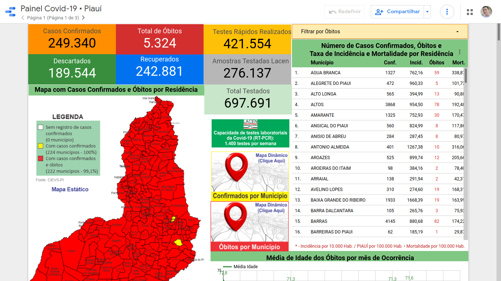
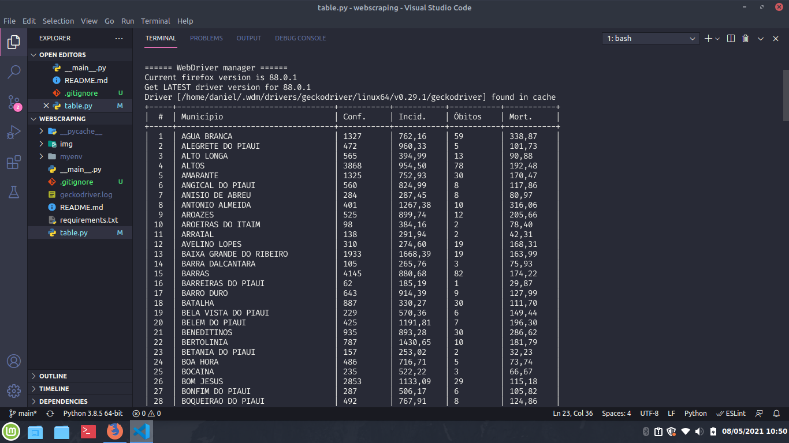

# Teste de Webscraping

Projeto de webscraping utilizado para buscar base de dados da Covid no estado no Piauí disponibilizados pelo Governo do Estado através do [Painel Epdemiológico Covid-19 do Pauí]('https://datastudio.google.com/reporting/a6dc07e9-4161-4b5a-9f2a-6f9be486e8f9/page/2itOB')

### Origem



### Dados Coletados



## Início rápido

Para utilizar esse projeto em sua máquina é necessário ter instalado o [Python]('https://www.python.org/') e o navegador [Firefox]('https://www.mozilla.org/pt-BR/firefox/new/')

### Instalação

```bash
  python3 -m venv myenv
  source myenv/bin/activate
  pip install install -r requirements.txt
```

### Execução

```bash
  python .
```

## Conhecimento

Este é um projeto de testes pessoal
